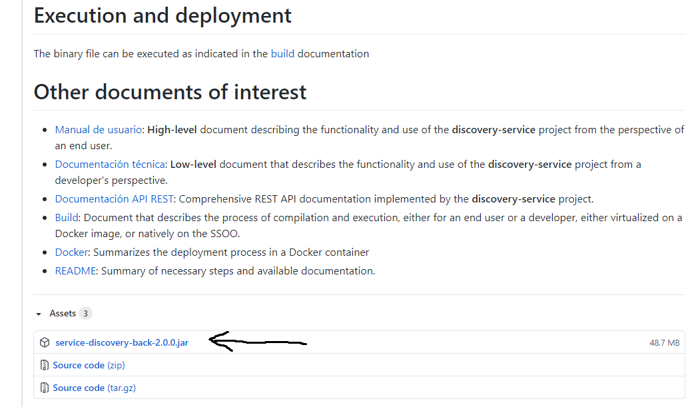

| Entregable     | Procesador de datos                                          |
| -------------- | ------------------------------------------------------------ |
| Fecha          | 17/12/2020                                                   |
| Proyecto       | [ASIO](https://www.um.es/web/hercules/proyectos/asio) (Arquitectura Semántica e Infraestructura Ontológica) en el marco de la iniciativa [Hércules](https://www.um.es/web/hercules/) para la Semántica de Datos de Investigación de Universidades que forma parte de [CRUE-TIC](http://www.crue.org/SitePages/ProyectoHercules.aspx) |
| Módulo         | Service Discovery                                            |
| Tipo           | Software                                                     |
| Objetivo       | Módulo Service Discovery para el proyecto Backend SGI (ASIO). |
| Estado         | Completado al **100%**                                       |
| Próximos pasos | Si fuese necesario, registrar otros servicios en el módulo   |
| Documentación  | [Manual de usuario](./docs/manual_de_usuario.md) (documentación de alto nivel)<br />[Documentación técnica](./docs/documentacion-tecnica.md) (documentación de bajo nivel)<br/>[Documentación API REST de la librería de descubrimiento](./docs/documentacion_api_rest_de_la_libreria_de_descubrimiento.md) (documentación de bajo nivel)<br/>[docker](./docs/docker.md)<br/>[Librería de descubrimiento](https://github.com/HerculesCRUE/ib-discovery)<br/>[Service Discovery](https://github.com/HerculesCRUE/ib-service-discovery) |


# Compilación

En el presente documento se describen los pasos necesarios para compilar/ejecutar el presente servicio. Para ello se detallan los pasos necesarios, según el perfil de usuario, pudiéndose así adaptar a distintos entornos de despliegue

## Despliegue del entorno

El servicio Service Discovery, tiene dependencias con las siguientes herramientas:

* MariaDB

Por lo tanto es necesario que estén configurados los parámetros de conexión a dichos componentes. Estos parámetros de conexión pueden establecerse por medio de variables de entorno tal como se indica en el fichero [README.md](https://github.com/HerculesCRUE/ib-uris-generator/blob/master/README.md#variables-de-entorno) (sección Variables de entorno).

También es posible y recomendable desplegar el entorno (con las dependencias adecuadamente configuradas para su uso por la librería) mediante docker-compose

En el directorio **docker-devenv** se ha configurado un fichero docker-compose.yml para poder arrancar el entorno de desarrollo.

Para arrancar el entorno:

```bash
docker-compose up -d
```

Para pararlo:

```bash
docker-compose down
```

## 

## Despliegue de la librería

Se describen los siguientes modos para ejecutar la aplicación según el perfil de usuario:

#### Usuarios finales

En la presente sección se describen los pasos a seguir por un usuario final, el cual definimos como aquel usuario que únicamente tiene interés en  ejecutar la librería de la forma más simplificada posible, abstrayéndose de detalles de implementación.

Para ello daremos dos opciones:

##### Ejecución sobre SSOO nativo

###### Requisitos

* OpenJDK 11 (disponible [aquí](https://openjdk.java.net/projects/jdk/11/))
* Maven 3.6.x (disponible [aquí](https://maven.apache.org/download.cgi))

###### Despliegue y ejecución

Para ello tenemos que seguir los siguientes pasos:

1. Descarga de binarios de la ultima release en el [repositorio de la librería](https://github.com/HerculesCRUE/ib-service-discovery/releases).




2. Configurar variables de entorno (si no queremos aplicar los valores por defecto) tal como se indica en [README.md](../README.md)
3. Ejecutar librería desde el fichero .jar descargado mediante el siguiente comando siguiente comando (desde el directorio donde se encuentra el .jar)

```bash
java -jar service-discovery-back-2.0.0.jar
```

3. Una vez ejecutado el jar tendremos desplegados (SERVER_PORT por defecto esta configurado a 9329):
   - Aplicación discovery: http://localhost:{SERVER_PORT}
   - Swagger discovery: http://localhost:{SERVER_PORT}/swagger-ui.html

#### Desarrolladores

En la presente sección se describen los pasos a seguir por un usuario técnico o avanzado, el cual definimos como aquel usuario interesado en los detalles de la implementación y con acceso al codigo fuente.

##### Compilación

###### Requisitos

* Git (disponible [aquí](https://git-scm.com/book/en/v2/Getting-Started-Installing-Git))
* OpenJDK 11 (disponible [aquí](https://openjdk.java.net/projects/jdk/11/))
* Maven 3.6.x (disponible [aquí](https://maven.apache.org/download.cgi))

Para ello tenemos que seguir los siguientes pasos:

1. Descarga de el código fuente en el repositorio del proyecto

   ```bash
   git clone https://github.com/HerculesCRUE/ib-service-discovery.git
   ```

2. Compilación del proyecto con el comando 

   ```bash
   mvn clean package
   ```

   Este comando, compilara el proyecto, gestionara las dependencias , ejecutara los test y creara los ejecutables binarios

##### Ejecución sobre SSOO nativo

###### Requisitos

* Los anteriores

###### Ejecución

1. Buscar y acceder modulo **discovery-back** y copiar el ejecutable **discovery-back-1.0.0.jar** a el directorio deseado para su ejecución.

2. Configurar variables de entorno (si no queremos aplicar los valores por defecto) tal como se indica en [README.md](../README.md#variables-de-entorno)

3. Ejecutar el comando

   ```bash
   java -jar service-discovery-back-2.0.0.jar
   ```

4. Una vez ejecutado el jar tendremos desplegados (SERVER_PORT por defecto esta configurado a 9326):

   - Aplicación discovery: http://localhost:{SERVER_PORT}
   - Swagger discovery: http://localhost:{SERVER_PORT}/swagger-ui.html

##### Ejecución sobre contenedor Docker

###### Requisitos

* Docker (disponible [aquí](https://docs.docker.com/get-docker/))

###### Ejecución

1. Buscar y acceder por consola a el directorio **docker-build**, donde se encuentra el fichero Dockerfile de configuración para creación del contenedor.

2. Ejecutar el comando para crear la imagen del contenedor

   ```bash
   docker build --tag {nombre_imagen:versión_imagen} .
   ```

3. Configurar variables de entorno (si no queremos aplicar los valores por defecto) tal como se indica  en [README.md](https://github.com/HerculesCRUE/ib-uris-generator/blob/master/README.md#variables-de-entorno)

4. Ejecutar imagen creada con el siguiente comando

   ```bash
   docker run -d -p {puerto_externo:puerto_interno} {nombre_imagen:versión_imagen} -t {nombre_imagen:versión_imagen}
   ```

   - -d: Indica que se ejecute en segundo plano
   - -p: establece el mapeo de puertos entre el puerto externo y el puerto interno
   - -t: Tag que se aplacará a la imagen.

5. Una vez ejecutado el jar tendremos desplegados (SERVER_PORT por defecto esta configurado a 9326):

   - Aplicación discovery-service: http://localhost:{SERVER_PORT}
   - Swagger discovery-service: http://localhost:{SERVER_PORT}/swagger-ui.html

### Modulos

#### Back

Los artefactos se encuentran dentro de discovery-back/target

* Artefacto: discovery-service-back-{version}.jar

#### Service

Los artefactos se encuentran dentro de discovery-service/target

* Artefacto: discovery-service-back-{version}.jar

#### Service Abstractions

Los artefactos se encuentran dentro de discovery-service-abstractions/target

* Artefacto: discovery-service-abstractions-{version}.jar

#### JPA Abstractions

Los artefactos se encuentran dentro de discovery-jpa-abstractions/target

* Artefacto: discovery-service-jpa-abstractions-{version}.jar
