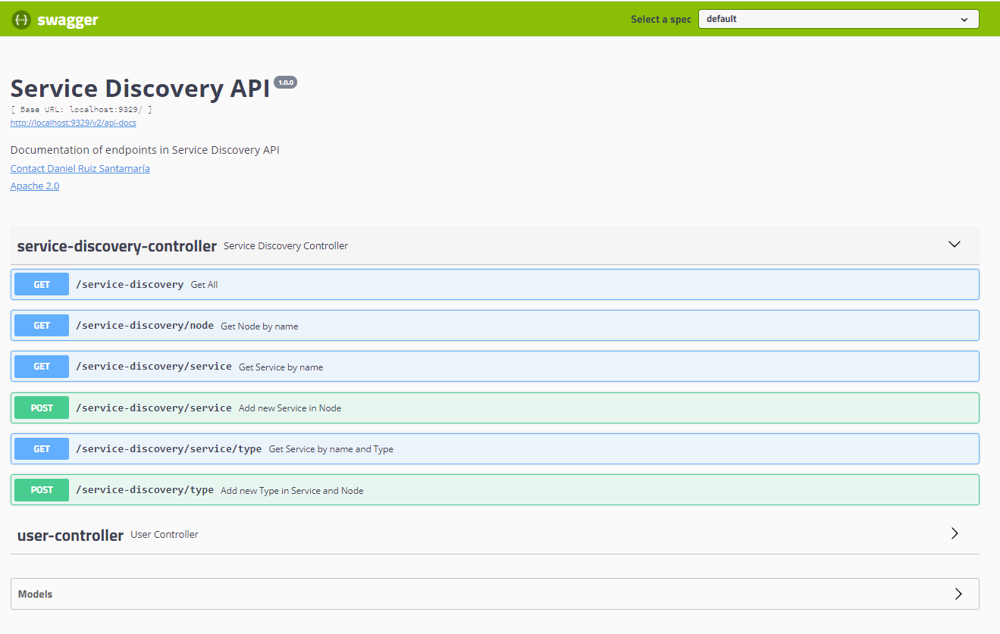

| Entregable     | Procesador de datos                                          |
| -------------- | ------------------------------------------------------------ |
| Fecha          | 17/12/2020                                                   |
| Proyecto       | [ASIO](https://www.um.es/web/hercules/proyectos/asio) (Arquitectura Semántica e Infraestructura Ontológica) en el marco de la iniciativa [Hércules](https://www.um.es/web/hercules/) para la Semántica de Datos de Investigación de Universidades que forma parte de [CRUE-TIC](http://www.crue.org/SitePages/ProyectoHercules.aspx) |
| Módulo         | Service Discovery                                            |
| Tipo           | Software                                                     |
| Objetivo       | Módulo Service Discovery para el proyecto Backend SGI (ASIO). |
| Estado         | Completado al **100%**                                       |
| Próximos pasos | Si fuese necesario, registrar otros servicios en el módulo   |
| Documentación  | [Manual de usuario](./manual_de_usuario.md) (documentación de alto nivel)<br />[Documentación técnica](./documentacion-tecnica.md) (documentación de bajo nivel)<br/>[Documentación API REST de la librería de descubrimiento](./documentacion_api_rest_de_la_libreria_de_descubrimiento.md) (documentación de bajo nivel)<br/>[Docker](./docker.md)<br/>[Librería de descubrimiento](https://github.com/HerculesCRUE/ib-discovery)<br/>[Service Discovery](https://github.com/HerculesCRUE/ib-service-discovery) |

## Despliegue

Se puede encontrar documentación exhaustiva de desplieguen en el documento [build](./build.md) tanto para usuarios finales como para desarrolladores.

### Requisitos

* OpenJDK 11
* Maven 3.6.x
* Docker

### Compilación

Para realizar la compilación se ejecutará el siguiente comando:

```bash
mvn clean package
```

También sería posible instalar o desplegar los artefactos sustituyendo `package` por `install` o `deploy` respectivamente.

Los artefactos se generarán dentro del directorio `target` de cada uno de los módulos:

#### Módulo Back

Módulo que añade una capa de servicios REST a la funcionalidad de la aplicación.

Los artefactos se encuentran dentro de discovery-service-back/target

* Artefacto: discovery-service-back-{version}.jar

#### Módulo Service

Módulo que contiene la lógica de la aplicación. Puede ser utilizado como librería independiente para ser integrado en otras aplicaciones

* Los artefactos se encuentran dentro de discovery-services-service/target

  * Artefacto: discovery-services-service-{version}.jar

#### Módulo jpa-abstractions

Módulo con utilidades para el acceso a datos mediante JPA.

#### Módulo service-abstractions

Módulo con utilidades para la generación de servicios.

#### Módulo swagger

Módulo que contiene la funcionalidad necesaria para añadir [Swagger](https://swagger.io/) para la interacción con el API Rest.

#### Módulo audit

Módulo que contiene la funcionalidad necesaria para la generación de datos de auditoría para las tablas de base de datos.

### Ejecución

Al generarse un JAR bootable la ejecución se realizará mediante el siguiente comando:

```bash
java -jar {jar-name}.jar
```

Sustituyendo `{jar-name}` por el nombre del fichero JAR generado.

No es necesario especificar la clase de inicio de la aplicación, ya que el fichero MANIFEST.MF generado ya contiene la información necesaria. Solamente se especificarán los parámetros necesarios.

### Ejecución de test

Los test de integración pueden ejecutarse con el siguiente comando

```bash
mvn clean verify
```

Esto generara reportes sobre el resultado de dichos test, disponibles en la ruta 

```
./target/surefire-reports
```

### Modelo de datos

Se usa un modelo de datos Relacional para modelar:

* **Nodos:** Entendemos como nodo una instancia de la solución ASIO, como por ejemplo la universidad de Murcia

* **Servicios:** Entendemos como un servicio, una componente determinado desplegado en una instancia, que ofrece algun tipo de funcionalidad. Por ejemplo, el servicio de Federación desplegado en el nodo de la universidad de Murcia.

* **Tipo:** Entendemos un tipo, como una funcionalidad concreta dentro de un servicio. Por ejemplo el servicio de Federación puede tener los tipos Fuseki (para interactuar con el triple Store TDB) o wikibase (para interactuar con el triple store asociado a wikibase), dentro de el nodo de la universidad de Murcia.

  

El modelo de datos usado por la aplicación, se puede apreciar bajo estas líneas.


Entre las entidades destacan:

* **node:** Modela un nodo. El único atributo relevante es el nombre del nodo
* **service:** Modela un servicio. Tiene los siguientes atributos:
  * **id:** Identificador único.
  * **base_url:** Host donde el servicio se encuentra desplegado.
  * **port:** Puerto donde el servicio esta escuchando.
  * **health_endpoint:** Endpoint donde el servicio de descubrimiento comprobará el estado del servicio.
  * **name:** Nombre del servicio.
  * **status** Estado del servicio, generado a partir de llamadas de el servicio de descubrimiento, al health_endpoint definido. Puede ser uno de los siguientes:
    * UP: Cuando la última llamada al end point health para checkear el estado termino de forma satisfactoria.
    * DOWN: Cuando la última llamada al end point health para checkear el estado termino de forma errónea.
    * UNKNOWN: Cuando aun no se ha podido realizar ninguna llamada al end point health para checkear el estado.
  * **node_id:** Nodo al que pertenece el servicio
* **type:** Modela  una funcionalidad concreta dentro de un servicio. Tiene los siguientes atributos:
  * **id:** Identificador único.
  * **name:** Nombre del tipo.
  * **suffix_url:** Sufijo que hay que añadir a el atributo base_url del servicio al que pertenece el tipo, para acceder a los endpoint relativos al tipo.
  * **service_id:** Servicio al que pertenece el tipo.
* **health_request:** Modela la auditoria de las llamadas a el endpoint health, para checkear el estado de todos los servicios registrados.

### Implementación

#### Arquitectura

El proyecto esta desarrollado sobre el arquetipo de Izertis para APIs REST, desarrollado sobre el Framework [Spring Boot](https://spring.io/projects/spring-boot), usando el [patrón MVC](https://es.wikipedia.org/wiki/Modelo–vista–controlador).

##### Controladores

Para separar convenientemente los controladores que manejan las peticiones todos ellos se encapsulan en el modulo **discovery-service-back**.

En este caso, solo existe un controlador, implementado en forma de un API que es el que recibe todas las peticiones por parte de un usuario o otra aplicación:

- **ServiceDiscoveryController: ** Controlador que gestiona todas las peticiones sobre el módulo de Discovery Service, entre las que se encuentran:
  - **GET /service-discovery**: Retorna todos los nodos, servicios y tipos disponibles en el service discovery, retornandolos en forma de árbol jerarquizado con la jerarquía nodo -> servicios -> tipos. 
  - **GET /service-discovery/node**: Retorna el nodo y todos los servicios y tipos disponibles en el service discovery para el nodo pasado por parámetro, retornándolos en forma de árbol jerarquizado con la jerarquía nodo -> servicios -> tipos. 
  - **GET /service-discovery/service**: Retorna todos los nodos, el servicio y tipos disponibles en el service discovery para el servicio pasado por parámetro, retornándolos en forma de árbol jerarquizado con la jerarquía nodo -> servicios -> tipos. 
  - **POST /service-discovery/service**: Permite registrar un servicio, dentro de un nodo.
  - **GET /service-discovery/service/type**: Retorna todos los nodos, el servicio y el tipo disponibles en el service discovery para el servicio y el tipo pasado por parámetro, retornándolos en forma de árbol jerarquizado con la jerarquía nodo -> servicios -> tipos.
  - **POST /service-discovery/type:** Permite registrar un tipo, dentro de un servicio.

##### Servicios

Para separar convenientemente los servicios que contienen la lógica de negocio todos ellos se encapsulan en el modulo **service-discovery-service**, dentro del paquete **service**.

Entre los mas destacados tenemos los siguientes:

* **HealthRequestService:** Es el servicio encargado de checkear al registrarlos, y periódicamente el estado de los servicios.
* **ServiceDiscoveryService:** Es el servicio encargado de gestionar las peticiones realizadas por el controlador interactuando para ello con el resto de servicios.
* **NodeService:** Es el servicio encargado de manejar la lógica de negocio en las operaciones CRUD sobre la entidad Node.
* **ServiceService:** Es el servicio encargado de manejar la lógica de negocio en las operaciones CRUD sobre la entidad Service.
* **TypeService:** Es el servicio encargado de manejar la lógica de negocio en las operaciones CRUD sobre la entidad Type.

##### Repositorios

Para separar convenientemente los repositorios que interactúan con las fuentes de datos. Estos se encapsulan en el modulo **service-discovery-service**, dentro del paquete **repository**. Entre ellos cabe destacar:

* **HealthRequestRepository:** Realiza todas las operaciones CRUD sobre la entidad heath_request.
* **NodeRepository:**  Realiza todas las operaciones CRUD sobre la entidad Node.
* **ServiceRepository:**  Realiza todas las operaciones CRUD sobre la entidad Service.
* **TypeRepository:**  Realiza todas las operaciones CRUD sobre la entidad Type.

##### Modelos

POJOS o JPAs que modelan las entidades descritas en el apartado [Modelo de datos](#Modelo-de-datos)

### Metodología de desarrollo

La metodología de desarrollo es [Git Flow](https://www.atlassian.com/es/git/tutorials/comparing-workflows/gitflow-workflow).

### Entorno de desarrollo Docker

La generación de la imagen Docker y su despliegue están descritas en el documento [Generación Docker](./docker.md)

También es necesario desplegar el entorno de servicios necesarios, por ejemplo Elasticsearch, REDIS, Kafka, Zookeeper y MariaDB.

Para ello existe en el directorio **docker-devenv** el dichero docker-compose.yml que despliega dicho entorno. Para ello es suficiente ejecutar los siguientes comandos:

 Para arrancar el entorno:

```bash
docker-compose up -d
```

Para pararlo:

```bash
docker-compose down
```

### Variables de entorno

La aplicación se puede configurar por medio del fichero de configuración **application.yml** o mediante variables de entorno.

El fichero de configuración será la configuración usada para cualquier variable de entorno que no este configurada

Será preciso configurar las siguientes variables de entorno cuando se instale en un entorno real (el resto pueden ser cambiadas si se desea en el fichero de configuración y en caso contrarío se usara el valor por defecto):

* Relativas a la Base de datos Relacional

| Variable                                       | Descripción                                           | Valor por defecto                                            |
| ---------------------------------------------- | ----------------------------------------------------- | ------------------------------------------------------------ |
| `APP_PERSISTENCE_DATASOURCE_DRIVER-CLASS-NAME` | Driver usado para la conexión a BBDD Relacional       | org.mariadb.jdbc.Driver                                      |
| `APP_PERSISTENCE_DATASOURCE_USERNAME`          | Usuario para la conexión a BBDD Relacional            | app                                                          |
| `APP_PERSISTENCE_DATASOURCE_PASSWORD`          | Password para la conexión a BBDD Relacional           | sqlpass                                                      |
| `APP_PERSISTENCE_DATASOURCE_URL`               | Cadena de conexión para la conexión a BBDD Relacional | jdbc:mariadb://127.0.0.1:3307/discovery?ssl=false&createDatabaseIfNotExist=true |

* Relativas a el periodo para comprobar el estado de los servicios

| Variable                           | Descripción                                                  | Valor por defecto |
| ---------------------------------- | ------------------------------------------------------------ | ----------------- |
| `APP_CHECK_SERVICES_STATUS_PERIOD` | Periodo de tiempo (en milisegundos). tras el cual se comprueba el estado del servicio invocando al end point /health configurado para el servicio | 9329              |

* Relativas a el puerto donde se desplegara la aplicación

| Variable      | Descripción                                | Valor por defecto |
| ------------- | ------------------------------------------ | ----------------- |
| `SERVER_PORT` | Puerto para el despliegue de la aplicación | 9329              |

### Swagger

Se desplegara un API Swagger automáticamente al desplegar el proyecto.

El API esta disponible en

[http://{HOST_SERVICE_DISCOVERY}:[SWAGGER_PORT]/swagger-ui.html](http://localhost:9329/swagger-ui.html)

Para activar Swagger se utilizará la variable `app.swagger.enabled`


## API REST de Librería de descubrimiento

El API Rest en su totalidad se encuentra documentado, mediante Swagger.

Swagger se desplegara de forma automática,  al ejecutar el proyecto, en el mismo host y el mismo puerto configurado en el application.yml.

Por lo tanto se podrá acceder a Swagger mediante una URL de es siguiente formato:  

[http://{HOST_LIBRERIA_DE_DESCUBRIMIENTO}:[SWAGGER_PORT]/swagger-ui.html](http://localhost:9329/swagger-ui.html)

En caso de ejecutar en la maquina local, con la configuración presente actualmente en el fichero application.yml, la URI resultante será

http://localhost:9329/swagger-ui.html

Obteniendo el siguiente resultado



Por otro lado, puede encontrarse una documentación exhaustiva de los Endpoint desplegados por el API, en el documento

[Documentación API REST](./documentacion_api_rest.md)