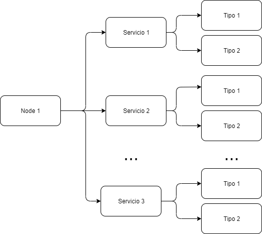

| Entregable     | Procesador de datos                                          |
| -------------- | ------------------------------------------------------------ |
| Fecha          | 17/12/2020                                                   |
| Proyecto       | [ASIO](https://www.um.es/web/hercules/proyectos/asio) (Arquitectura Semántica e Infraestructura Ontológica) en el marco de la iniciativa [Hércules](https://www.um.es/web/hercules/) para la Semántica de Datos de Investigación de Universidades que forma parte de [CRUE-TIC](http://www.crue.org/SitePages/ProyectoHercules.aspx) |
| Módulo         | Service Discovery                                            |
| Tipo           | Software                                                     |
| Objetivo       | Módulo Service Discovery para el proyecto Backend SGI (ASIO). |
| Estado         | Completado al **100%**                                       |
| Próximos pasos | Si fuese necesario, registrar otros servicios en el módulo   |
| Documentación  | [Manual de usuario](./manual_de_usuario.md) (documentación de alto nivel) [Documentación técnica](./documentacion-tecnica.md) (documentación de bajo nivel) [Documentación API REST de la librería de descubrimiento](./documentacion_api_rest_de_la_libreria_de_descubrimiento.md) (documentación de bajo nivel) [docker](./docker.md) [Librería de descubrimiento](https://github.com/HerculesCRUE/ib-discovery) [Service Discovery](https://github.com/HerculesCRUE/ib-service-discovery) |

# Manual de usuario

El presente documento realiza una descripción de el servicio **Service Discovery** a alto nivel, por lo tanto, se complementa con el documento de [Documentación técnica](./documentacion-tecnica.md) que la describe a bajo nivel.

Este módulo tiene como principal función actuar como nodo centralizado donde los demás servicios puedan registrarse, de forma que la solución ASIO, pueda conocer la ubicación de dichos servicios en cualquier nodo y su estado.

Tiene las siguientes funciones principales:

* Permitir el registro de Servicios, asociados a un determinado nodo
* Mantener el estado de los servicios, para lo cual, se realizara una petición periódica a el healthEndpoint asociado al servicio, pudiendo de esta forma gestionar el estado. 

## Despliegue

Se puede encontrar documentación exhaustiva de desplieguen en el documento [build](./build.md) tanto para usuarios finales como para desarrolladores.

## Entorno

El módulo Discovery Service, necesita las siguientes herramientas:

* MariaDB

Se puede encontrar información sobre el despliegue del entorno el el documento [build.md (seccion Despliegue del entorno)](https://github.com/HerculesCRUE/ib-discovery/blob/master/docs/build.md#Despliegue-del-entorno)

## Estructuras de datos

El módulo Discovery Service se apoya, en las estructuras de datos, descritas en la [Documentación técnica](./documentacion-tecnica.md).

Cabe destacar las siguientes entidades:

* **nodo:** Corresponde a una instancia de la solución ASIO, por ejemplo la Universidad de Murcia
* **servicio:** Corresponde a un servicio concreto de un nodo determinado, por ejemplo el servicio de Federación, para el nodo de la Universidad de Murcia
* **Tipo:** Corresponde a un determinado conjunto de funcionalidades del servicio, por ejemplo, el tipo Fuseki (que accede solo a los datos almacenados en Fuseki), del servicio de Federación, para el nodo de la Universidad de Murcia

## API REST del módulo Service Discovery

El API Rest en su totalidad se encuentra documentado, mediante Swagger.

Swagger se desplegara de forma automática,  al ejecutar el proyecto, en el mismo host y el mismo puerto configurado en el application.yml.

Por lo tanto se podrá acceder a Swagger mediante una URL de es siguiente formato:  

[http://{HOST_SERVICE_DISCOVERY}:[SWAGGER_PORT]/swagger-ui.html](http://localhost:9329/swagger-ui.html)

En caso de ejecutar en la maquina local, con la configuración presente actualmente en el fichero application.yml, la URI resultante será

http://localhost:9329/swagger-ui.html

Obteniendo el siguiente resultado

Por otro lado, puede encontrarse una documentación exhaustiva de los Endpoint desplegados por el API, en el documento [Documentación API REST](./documentacion_api_rest.md)
